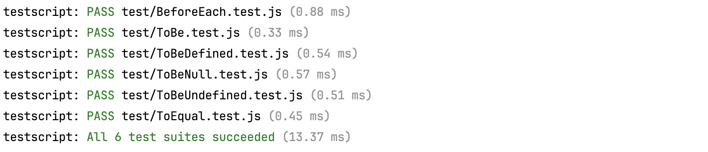

# testscript-js

I am fed up of the difficulty to run JavaScript tests in this messy world of Node + common JS + ESM. I just want to run JavaScript tests of my JavaScript code, period.
(see [testcript](https://www.npmjs.com/package/@javarome/testscript) for TypeScript version)

The alternative here is as follows:

- Run all JS stuff using `node`.
- *A test is a JS executable*: you don't need a test runner to run a single test file, but just to execute:
  ```
  node src/MyTest.js
  ````
  will throw an Error if the test doesn't pass (this will work with a tsx alternative as well but tsx makes it even easier).
- Keep syntax as similar as possible to the syntax used by [Jest](https://jestjs.io) (`describe()`, `test()`, `expect()`, `beforeEach()`...) , which is the most popular framework to test JS/TS.

```js
// MyTest.js
import { describe, expect, test } from '@javarome/testscript';

describe("Some software item", () => {

  test("does something", async () => {
    const item = new SoftwareItem('item1')
    expect(item.name).toBe("item1")
    expect(item.name).not.toBe("item2")
  })
})
```

- The only remaining thing you need is a [`TestRunner`](https://github.com/Javarome/testscript/blob/main/src/TestRunner.ts) to execute a bunch of tests given a file pattern.
  Using it, it's pretty easy to write your [main test program](https://github.com/Javarome/testscript/blob/main/src/test/testAll.ts) like below:

```js
// testAll.ts
import { TestRunner, TestError } from '@javarome/testscript';

const runner = new TestRunner(); // Look for *Test.ts files by default
runner.run().then(result => {
  const total = result.suites.length;
  const totalTime = `(${runner.durationStr(result.duration)})`;
  const success = runner.allSucceeded(result);
  if (success) {
    runner.logger.log(`All ${total} test suietes succeeded`, totalTime);
  } else {
    const successCount = runner.successCount(result);
    const errorSummary = !success ? ', ' + `${total - successCount} failed` : '';
    runner.logger.log(`${successCount}/${total} test suites succeeded` + errorSummary, totalTime);
  }
  if (!success) {
    throw new TestError('Tests run failed');
  }
});
````

You can then run it as a casual script:

## Debugging

The TestRunner uses a `DefaultLogger` instance as a `Logger`, which can be specified as a second argument.

````json
{
  "scripts": {
    "test": "node test/testAll.js"
  }
}
````

This will output:

And an error will output as:


## Debugging

You can debug the test runner by running a Node script in debugging mode from your IDE.
Should you want to debug a single test, just debug a script running only this one:

````json
{
  "scripts": {
    "test-one": "node src/test/MyTest.js"
  }
}
````

Also note that the TestRunner uses a `DefaultLogger` instance as a `Logger`, which can be specified as a second argument.
