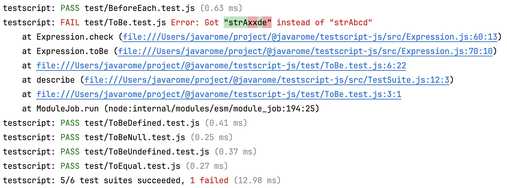

# testscript-js

*Since the advent of [NodeJS test API](https://nodejs.org/api/test.html), I recommend using it instead of this package.*

---

Fed up of the difficulty to run tests in this messy world of Node + common JS + ESM + Babel + Jest + JavaScript (or [TypeScript](https://www.npmjs.com/package/@javarome/testscript))?
You just want to run your tests of your code, period? The alternative here is as follows:

- Run all JavaScript stuff using `node`.
- *A test is an executable*: you don't need a test runner to run a single test file. Instead, just execute the test file:
  ```
  node src/My.test.js
  ````
  Thanks to the `assert()` predicates, this will throw a `TestError` if the test doesn't pass.
- Keep syntax as similar as possible to the syntax used by [Jest](https://jestjs.io) (`describe()`, `test()`, `expect()`, `beforeEach()`...) , which is the most popular framework to test JS/TS.

```js
// MyTest.js
import { describe, expect, test } from '@javarome/testscript-js';

describe("Some software item", () => {

  test("does something", async () => {
    const item = new SoftwareItem('item1')
    expect(item.name).toBe("item1")
    expect(item.name).not.toBe("item2")
  })
})
```

- The only remaining thing you need is a [`TestRunner`](https://github.com/Javarome/testscript/blob/main/src/TestRunner.ts) to locate tests and execute them at once.
  One can be run using this command:

```
testscript-js
````

This will output:

And an error will output as:



Of course this is typically what you want to run for your `test` npm script.

By default, it will look for all `*.test.ts` files in all subdirs, 
but you can specifiy a different file pattern, like:
```
testscript-js --include **/*.spec.js 
````

By default `node_modules` are ignored. You can also customize those excluded paths by specifying a second argument, which can be an array of paths:
```
testscript-js --include **/*.test.js --exclude '{out/**,node_modules/**/*.*}'
```

You can also use the `TESTSCRIPT_INCLUDE` and `TESTSCRIPT_EXCLUDE` env vars.

## Debugging

Once you have your test scripts ready in your `package.json`, all you need to need all or one test is to set your breakpoints in your tests
and run those scripts in debug mode.

Also note that the `TestRunner` uses a `DefaultLogger` instance as a `Logger`, which can be specified as its third constructor argument.
